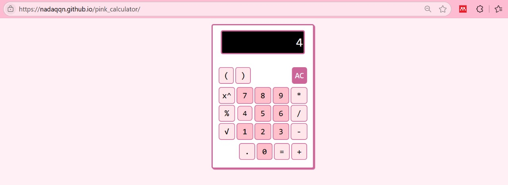

## 🎀 Pink-Themed Calculator
Hello! 👋
This repository features a stylish twist on a basic calculator — originally sourced from a charming open-source widget and redesigned with a vibrant pink theme and improved UI/UX flair! 🧠💖

## 📸 Preview
🔗 Original Repository (Credits): ShoroukAziz's Minimal Calculator
🌐 Try it live here: [Live Demo](https://nadaqqn.github.io/pink_calculator/)

## 🎯 Features
This project evolved from a simple clone into a personalized creative playground! Here's what makes it special:

🎨 Pink-Themed Interface – A fresh and playful look with modern design vibes.
🧮 Basic Calculator Functions – Addition, subtraction, multiplication, and division – all you need!
🔄 Refactored Code – Cleaner structure and better readability for easier maintenance.
🧩 Enhanced UX – Improved button layout and interaction responsiveness for a smoother experience.
📱 Mobile-Friendly – Responsive design that works great across different screen sizes.

## 💻 Tech Stack
Built using:

🌐 HTML  
🎨 CSS  
⚙️ JavaScript  

## 🚀 Future Improvements
🌈 Theme switcher (light/dark)  
🔢 Keyboard support  
📱 PWA support for offline use  
📊 History log of calculations  
💬 Sound or haptic feedback

## 🤝 Let's Collaborate!
Have ideas or want to improve this further? Feel free to fork, contribute, or reach out!

💌 linktr.ee: https://linktr.ee/qonitaqq  
> “Innovation is the ability to see change as an opportunity – not a threat.” – Steve Jobs 🔁

Thanks for stopping by! If you enjoy this little pink calculator, please give it a ⭐️ and share the love 💕
